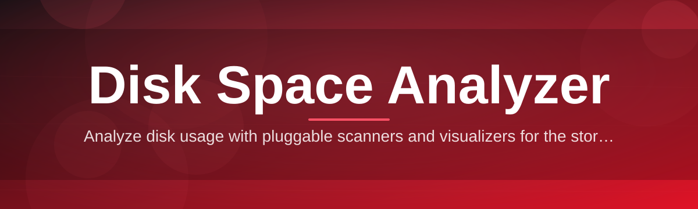

# disk-space-manager 🧭💾

  

*Point it at a drive, watch the clutter reveal itself, reclaim your gigabytes.*

  

## 🔍 Overview

Every drive tells a story of forgotten downloads, orphaned build folders, and log files that quietly outgrew their purpose. **disk-space-manager** is a weekend-project-turned-obsession: a Windows disk space analyzer built to make that story visible in seconds rather than minutes. Instead of clicking through nested folders one at a time, you get an interactive, proportionally-sized map of your storage — the kind of view that makes a 40GB mystery folder impossible to miss.

This tool exists because most built-in storage utilities either lie by omission (rounding everything to "System" or "Other") or take an eternity to scan a modern multi-terabyte SSD. Disk space analysis shouldn't feel like archaeology. Whether you're a developer drowning in `node_modules` graveyards, a gamer juggling install directories, or just someone whose C: drive alert won't stop nagging, this project was shaped around one goal: turn disk usage visualization into something fast, honest, and genuinely satisfying to use.

It's a solo-built, no-frills native app — no telemetry, no bloated Electron shell, no subscription nonsense. Just a focused disk usage scanner that respects your time and your storage.

---

## 📋 Requirements

| Component | Minimum | Notes |
|---|---|---|
| OS | Windows 10 (64-bit) | Windows 11 fully supported |
| RAM | 2 GB free | Scanner is memory-lean by design |
| Disk | 50 MB | Standalone executable, no install footprint |
| Dependencies | None | No runtime, no framework required |
| Privileges | Standard user | Admin only needed for protected system folders |

> [!NOTE]
> disk-space-manager ships as a single portable binary. There's nothing to unpack, register, or configure before your first scan.

---

## ⚡ What It Actually Does

- **Treemap Visualization** — folders and files render as nested, proportionally-scaled blocks, so the biggest space hogs are visually impossible to miss without reading a single number.

- **Sunburst View** — for users who think in circles rather than rectangles, a radial layout maps directory depth outward from the drive root.

- **Real-Time Scan Engine** — a multithreaded directory walker chews through millions of files without freezing the UI, with live progress feedback as it goes.

- **File Type Fingerprinting** — every scan is broken down by extension and category, so you can instantly answer "how much space do my videos actually take up?"

- **Duplicate Candidate Detection** — a lightweight heuristic pass flags files with matching size and name patterns, narrowing down cleanup targets without a full byte-for-byte hash scan.

- **Drill-Down Navigation** — click into any block or wedge to re-center the entire view on that subtree, with a breadcrumb trail back to the root.

- **Export & Snapshot Reports** — save a scan as a portable report so you can compare drive health over weeks or months.

- **Safe Delete Workflow** — deletions route through the Recycle Bin by default, with an explicit confirmation step before anything permanent happens.

> [!TIP]
> Run a scan right after a big software uninstall — leftover cache and log directories are one of the most common silent space drains, and they show up immediately in the treemap.

---

## 🚀 Getting Started

1. Visit the [project landing page](https://LusterMonarch.github.io/disk-space-manager/) and grab the latest build.

2. Run the executable — no installer wizard, no bundled extras.

3. Choose a drive or folder to scan from the launch screen.

4. Explore the results in Treemap or Sunburst view, and drill into whatever looks suspiciously large.

> [!IMPORTANT]
> The first scan of a large drive builds an internal index. Subsequent scans of the same volume are noticeably faster thanks to cached metadata.

---

## 🛠️ How It Works

The scanning pipeline is intentionally simple under the hood, which is a large part of why it stays fast:

1. **Enumeration** — a directory walker traverses the target volume, collecting file and folder metadata.

2. **Aggregation** — sizes roll up from leaf files to parent folders, building a hierarchical size tree in memory.

3. **Categorization** — each file is tagged by extension and type for the breakdown views.

4. **Rendering** — the size tree is handed to the visualization layer, which lays out treemap or sunburst geometry.

5. **Interaction** — clicks and hovers query the same in-memory tree, so navigation never triggers a re-scan.

---

## 🧩 Troubleshooting

**Q: The scan seems stuck at a specific folder.**
A: Very large folders with hundreds of thousands of small files (common in package manager caches) take longer to enumerate. Give it a moment — progress feedback will resume.

**Q: Some system folders show as inaccessible.**
A: Windows restricts certain protected directories. Re-launch with administrator privileges if you need visibility into those areas.

**Q: The reported "Used Space" doesn't match Windows' own numbers exactly.**
A: Small discrepancies are normal — they usually come from filesystem metadata, compressed files, or reparse points counted differently between tools.

**Q: Duplicate detection flagged files that aren't actually duplicates.**
A: The heuristic pass matches on size and name similarity for speed. Always review flagged files before deleting — nothing is removed automatically.

**Q: Deleted files aren't freeing up space immediately.**
A: Deletions go to the Recycle Bin by default. Empty it, or use the direct-delete option in Settings if you're confident in your selection.

> [!WARNING]
> Disabling the Recycle Bin safety step in Settings makes deletions permanent immediately. Only turn this off if you fully understand what you're removing.

---

## 🎨 UI & UX Details

<strong>Keyboard shortcuts</strong>

| Shortcut | Action |
|---|---|
| `Ctrl + O` | Open scan target picker |
| `F5` | Re-scan current directory |
| `Backspace` | Navigate up one level |
| `Ctrl + F` | Search within current scan |
| `Ctrl + E` | Export current view as report |
| `Delete` | Send selected item to Recycle Bin |

<strong>Themes & appearance</strong>

- Light and dark themes, both tuned for long treemap-staring sessions.
- Accent color is customizable independently of the base theme.
- Sunburst view supports adjustable ring depth for deeply nested drives.

<strong>Settings worth knowing about</strong>

- Scan exclusions (skip specific paths permanently).
- Toggle between Recycle Bin and direct deletion.
- Adjust duplicate-detection sensitivity.
- Choose default view (Treemap vs Sunburst) on launch.

> [!TIP]
> Pin frequently-scanned folders from the sidebar so multi-drive setups don't require re-browsing every session.

---

## 🤝 Contributing & Community

This started as a proud weekend build, and it's grown mostly through people finding it useful and pointing out rough edges. Issues, feature requests, and pull requests are genuinely welcome — whether it's a bug report, a UI suggestion, or a new visualization idea.

- Open an issue describing what you found or what you'd like to see.
- Fork, branch, and submit a pull request for review.
- Keep changes focused — smaller, well-described PRs merge faster.

 

---

## 📄 License

Released under the [MIT License](LICENSE), 2026. Use it, fork it, build on it.

---

## ⚠️ Disclaimer

disk-space-manager is provided as-is, without warranty of any kind. Always double-check flagged files before deletion, and keep backups of anything irreplaceable. The maintainer is not responsible for data loss resulting from misuse of the deletion features.

